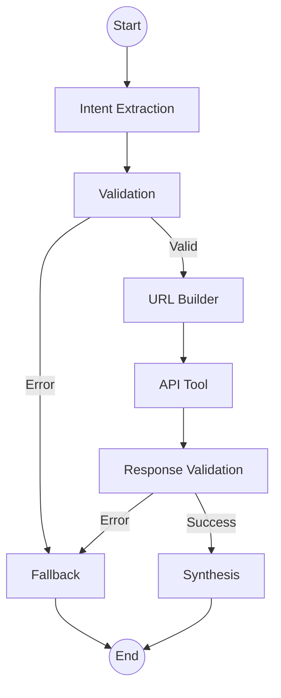

# Country Information AI Agent

This project is an AI agent designed to smartly answer queries about countries using the free [REST Countries API](https://restcountries.com/). It is built precisely utilizing **LangGraph**, **FastAPI**, and a robust **React (Vite)** interface without relying on Databases, RAG, or Embeddings as an architectural constraint.

**Live Demo:** [https://countryinfo-agent-3.onrender.com/](https://countryinfo-agent-3.onrender.com/)

## Features
- **Intelligent Reasoning:** Uses LangGraph to execute step-by-step logic nodes: Intent Extraction, Validation, URL Building, API Tool Execution, Response Validation, Synthesis, and Fallback handling.
- **Dynamic API Integrations:** Intelligently maps the user intent to specific endpoints (e.g., `/name`, `/capital`, `/lang`, `/region`, `/alpha`) and dynamically requests only the required `fields`.
- **FastAPI Backend:** Orchestrates the multi-node LangGraph flow via robust REST endpoints.
- **React Frontend:** A modular single-shot query/response interface utilizing Vite and modern Tailwind CSS.

## Agent Architecture (LangGraph Nodes)
The AI reasoning engine operates using a strict StateGraph pipeline.



1. **Intent Extraction Node**: Uses the LLM (gpt-4o-mini) to understand the user's query, extracting the specific intent (e.g. `get_country_info`), target entities, and necessary `fields`.
2. **Validation Node**: Checks if the extracted intent is supported and ensures that all necessary parameters were provided.
3. **URL Builder Node**: Dynamically constructs the precise `https://restcountries.com/v3.1` REST endpoint and appends necessary URL parameters for filtering.
4. **API Tool Node**: Executes the asynchronous HTTP GET request to fetch live country data.
5. **Response Validation Node**: Verifies that the API returned valid data and handles empty or failing responses.
6. **Synthesis Node**: Uses the LLM to pass the raw JSON data and the user query to synthesize a concise, grounded, human-readable response.
7. **Fallback Node**: A global error handler that triggers if the query is unrelated, an error occurs, or the required `OPENAI_API_KEY` is missing.

## Tech Stack
- **AI Core:** LangGraph, LangChain, OpenAI (gpt-4o-mini)
- **Backend:** FastAPI, Uvicorn, Pydantic
- **Frontend:** React, Vite, Tailwind CSS v4, Lucide React
- **External Data:** REST Countries API (`https://restcountries.com/v3.1`)

## Prerequisites
- Python 3.9+ 
- Node.js / NPM (v18+)
- OpenAI API Key

## Setup & Installation

1. Create a Python virtual environment and install backend dependencies:
```bash
python3 -m venv venv
source venv/bin/activate
pip install -r backend/requirements.txt
```

2. Configure backend environment variables by creating a `.env` file inside the `backend/` folder:
```env
# backend/.env
OPENAI_API_KEY="sk-your-openai-api-key"
```

3. Configure frontend environment variables by creating a `.env` file inside the `frontend/` folder:
```env
# frontend/.env
VITE_API_BASE_URL="http://localhost:8000"
```

## Running the Application

You will need two terminal tabs running simultaneously.

### 1. Start the Backend API
```bash
source venv/bin/activate
cd backend
uvicorn main:app --reload
```
The FastAPI backend will run on [http://localhost:8000](http://localhost:8000). You can check the documentation at `/docs`.

### 2. Start the Frontend UI
```bash
cd frontend
npm install
npm run dev
```
The React development server will become accessible at [http://localhost:5173](http://localhost:5173).

## Sample Queries
- *What is the population of India?*
- *Capital and currency of Japan*
- *Countries in Europe*
- *Countries using USD*
- *French speaking countries*
- *Country with capital Berlin*
